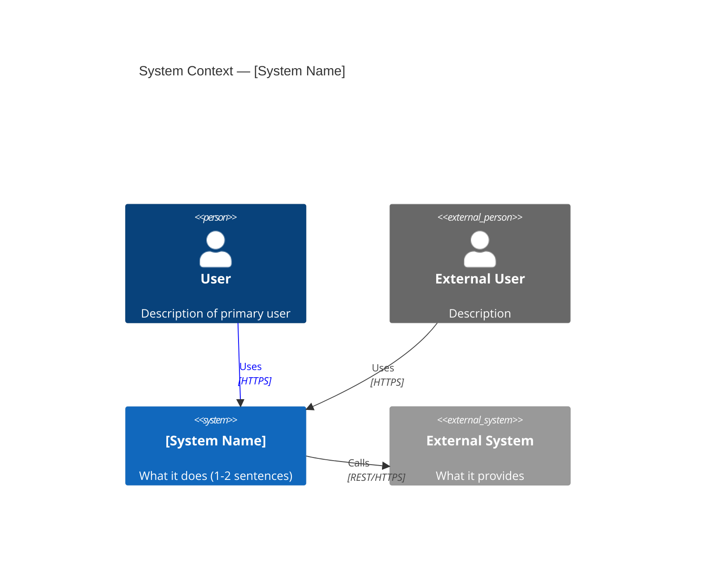
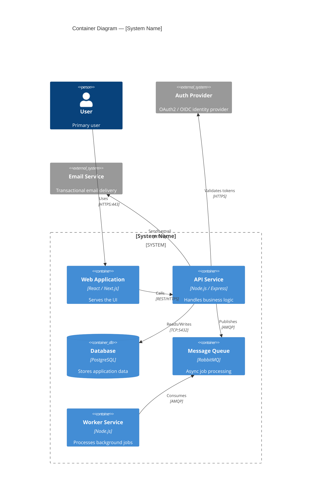
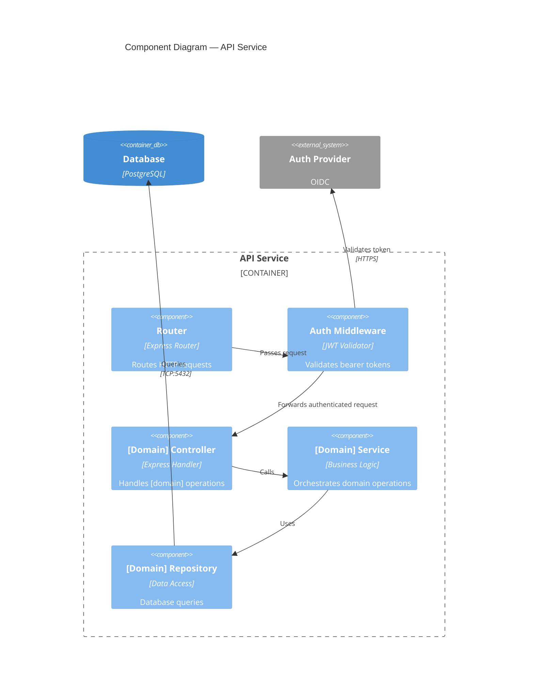
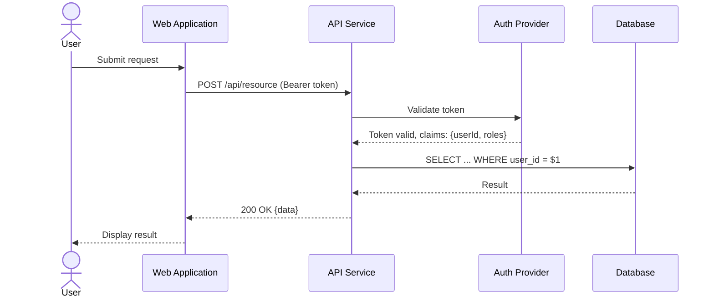
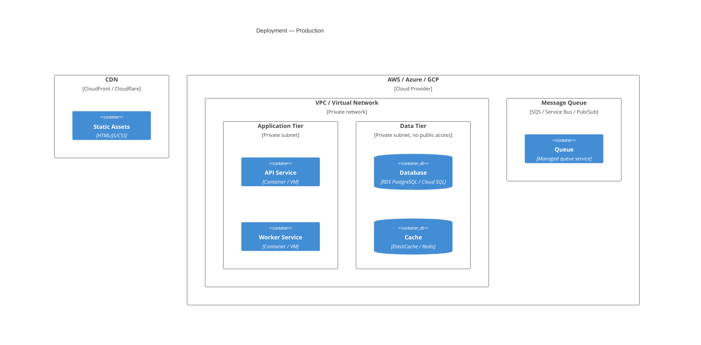

# C4 Model Reference

**Source:** c4model.com | **Version:** Living standard (Simon Brown)

## Overview

The C4 model provides a hierarchical set of diagrams for describing software architecture at different levels of abstraction. Use only the levels that add value — Levels 1 and 2 are sufficient for most teams.

| Level | Name | Audience | Question Answered |
|---|---|---|---|
| 1 | System Context | Everyone | What does this system do and who uses it? |
| 2 | Container | Developers + Architects | What are the major deployable units? |
| 3 | Component | Developers | What are the internals of a container? |
| 4 | Code | Developers | How is a component implemented? (rarely used) |

---

## Level 1: System Context Diagram

Shows the system in its environment — users, external systems, boundaries.

**Security annotation (required):**
- Trust boundary: identify where trust changes (internal ↔ external)
- All external actors are untrusted by default (Zero Trust: NIST SP 800-207)
- Flag: which relationships cross trust boundaries?

---

## Level 2: Container Diagram

Shows the deployable units (apps, databases, microservices, message queues) and their relationships.

**Security annotations (required for each container):**
| Container | STRIDE Threats | Mitigations |
|---|---|---|
| Web Application | XSS (Tampering), CSRF (Spoofing) | CSP headers, SameSite cookies, input sanitization |
| API Service | Broken Access Control (EoP), Injection (Tampering) | Auth middleware, parameterized queries, input validation |
| Database | Data breach (Info Disclosure), SQL Injection (Tampering) | Encryption at rest, least-privilege DB user, prepared statements |
| Message Queue | Message spoofing (Spoofing), Queue flooding (DoS) | Auth per connection, rate limiting, dead-letter queues |

---

## Level 3: Component Diagram

Shows internal structure of a single container. Use for complex containers only.

---

## Supplementary Diagrams

### Dynamic Diagram (sequence flow for a specific use case)

### Deployment Diagram

---

## Agent Instructions: Producing C4 Diagrams

When producing C4 diagrams:

1. **Always start at Level 1.** Never skip context.
2. **Always produce Level 2.** This is the primary value artifact.
3. **Produce Level 3 only** for containers where internals are non-obvious or complex.
4. **Never produce Level 4** unless explicitly requested.
5. **Security annotations are mandatory** — every Level 2 container gets a STRIDE row.
6. **Zero Trust default** — annotate every cross-boundary relationship with the trust assumption.
7. **Embed diagrams in Markdown** using Mermaid code blocks.
8. **File location:** `docs/architecture/diagrams/` in the project repo.
