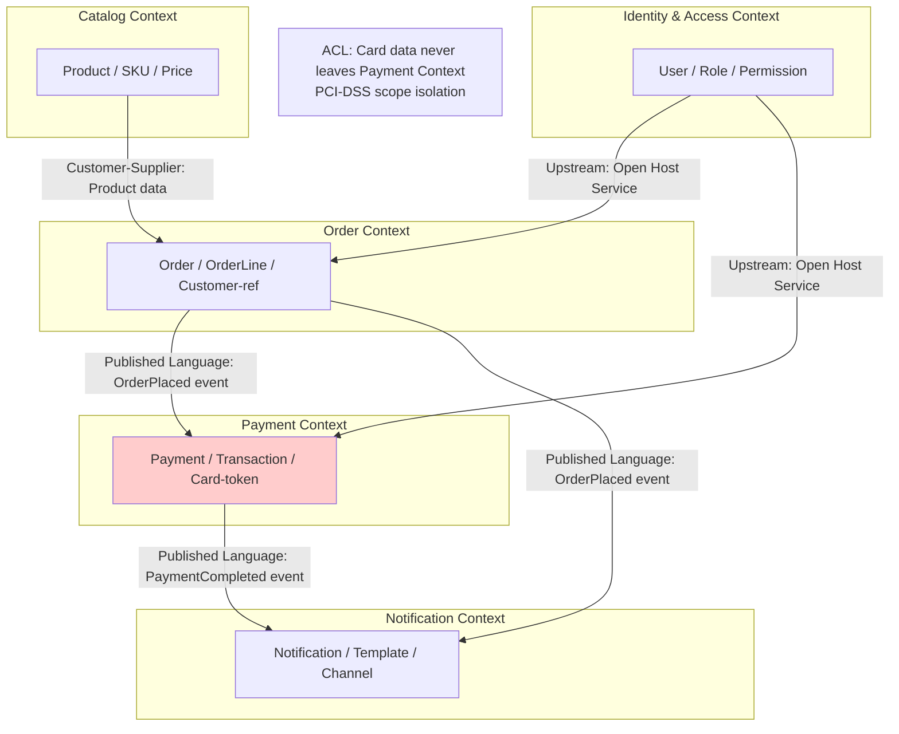

# Domain-Driven Design (DDD) Reference

**Source:** Eric Evans "Domain-Driven Design" (2003) + community evolution
**Modern references:** Vaughn Vernon "Implementing DDD", Alberto Brandolini (Event Storming)

## Overview

DDD is an approach to software design that focuses the team on the core domain, domain logic, and collaboration between technical and domain experts. Key artifacts:

1. **Bounded Context Map** — shows how domains relate
2. **Ubiquitous Language Glossary** — shared vocabulary within a bounded context
3. **Aggregate Design** — consistency boundaries within a context
4. **Event Storming** — collaborative domain discovery

---

## Bounded Context Map

A bounded context is an explicit boundary within which a domain model applies. Two contexts may use the same word (e.g., "Customer") but mean different things — the map makes those differences explicit.

### Context Map Patterns

| Pattern | Description | Use When |
|---|---|---|
| **Shared Kernel** | Two contexts share a subset of the domain model | Teams are closely aligned, high coordination |
| **Customer-Supplier** | Upstream context defines API; downstream consumes it | Clear upstream/downstream dependency |
| **Conformist** | Downstream adopts upstream model as-is | Can't influence upstream (e.g., third-party) |
| **Anticorruption Layer (ACL)** | Downstream translates upstream model | Upstream model is incompatible or messy |
| **Open Host Service** | Upstream publishes a formal, versioned protocol | Many downstream consumers |
| **Published Language** | Shared, well-documented domain language | Interoperability across many teams |
| **Separate Ways** | No integration between contexts | Teams are fully independent |
| **Big Ball of Mud** | No clear boundaries (anti-pattern to document and plan to fix) | Legacy systems |

### Bounded Context Map Template (Mermaid)



**Security note:** Use bounded contexts to define PCI-DSS, HIPAA, and PII scope boundaries. Cardholder data should never leave the Payment bounded context — tokenize at the boundary.

---

## Ubiquitous Language Glossary Template

```markdown
# Ubiquitous Language — [Context Name] Context

**Bounded Context:** [Name]
**Last Updated:** YYYY-MM-DD
**Domain Expert:** [Name]

> This glossary defines the meaning of terms within the [Context Name] bounded context only.
> The same term may mean something different in other contexts — see the Context Map.

## Terms

| Term | Definition | Synonyms (avoid) | Notes |
|---|---|---|---|
| **Order** | A customer's confirmed intent to purchase one or more products | Purchase, Request | "Order" in Catalog context means something different |
| **Customer** | An authenticated user who has placed at least one order | User, Buyer | In Identity context, this is called "User" |
| **Order Line** | A single product SKU and quantity within an Order | Item, Line Item | |
| **Fulfillment** | The process of picking, packing, and shipping an Order | Dispatch, Shipping | |
| **[Term]** | [Definition] | [Synonyms to retire] | [Notes] |
```

---

## Aggregate Design

An aggregate is a cluster of domain objects treated as a single unit for data changes. The **aggregate root** is the single entry point — external objects only hold a reference to the root, never to internal objects.

### Aggregate Design Rules

1. **One transaction per aggregate** — if an operation spans two aggregates, use eventual consistency (domain events)
2. **Reference by ID only** — aggregates reference other aggregates by ID, not by object reference
3. **Small aggregates** — prefer small, focused aggregates over large ones
4. **Protect invariants** — the aggregate root enforces all consistency rules

### Aggregate Template

```markdown
## Aggregate: [Name]

**Root entity:** [Root Entity Name]
**Invariants (rules the aggregate enforces):**
- [Invariant 1: e.g., "An Order must have at least one OrderLine"]
- [Invariant 2: e.g., "Total price cannot be negative"]

**Entities (within aggregate):**
- [Root Entity]
- [Child Entity 1]
- [Child Entity 2]

**Value Objects (within aggregate):**
- [Money: amount + currency — immutable]
- [Address: street, city, postal code — immutable]

**Domain Events (emitted by aggregate):**
- [OrderPlaced: emitted when Order transitions to "placed" state]
- [OrderCancelled: emitted when Order is cancelled]

**External references (by ID only):**
- customerId → Customer aggregate in Identity context
- productId → Product aggregate in Catalog context
```

---

## Event Storming Reference

Event Storming is a collaborative workshop technique (Alberto Brandolini) for rapid domain discovery using sticky notes.

### Sticky Note Legend

| Color | Meaning | Example |
|---|---|---|
| **Orange** | Domain Event (past tense) | "OrderPlaced", "PaymentFailed" |
| **Blue** | Command (imperative) | "PlaceOrder", "CancelOrder" |
| **Yellow** | Aggregate (noun) | "Order", "Payment" |
| **Purple** | Policy / Rule | "When OrderPlaced, then ReserveInventory" |
| **Pink** | External System | "Payment Gateway", "Email Provider" |
| **Green** | Read Model / View | "Order Summary", "Inventory Level" |
| **Red** | Hot Spot / Problem | Disagreement, ambiguity, or risk |

### Event Storming Output Template

```markdown
# Event Storming Output — [Domain/Session Name]

**Date:** YYYY-MM-DD
**Participants:** [names and roles]
**Scope:** [what domain was explored]

## Domain Events (timeline order)

1. [UserRegistered]
2. [EmailVerified]
3. [OrderCreated]
4. [PaymentInitiated]
5. [PaymentCompleted] / [PaymentFailed]
6. [InventoryReserved]
7. [OrderFulfilled]
8. [OrderShipped]
9. [OrderDelivered]

## Commands → Events Mapping

| Command | Actor | Aggregate | Domain Event |
|---|---|---|---|
| RegisterUser | Anonymous User | User | UserRegistered |
| PlaceOrder | Customer | Order | OrderCreated |
| ProcessPayment | Order Policy | Payment | PaymentCompleted |

## Policies (Business Rules)

| When | Then |
|---|---|
| OrderCreated | Initiate payment |
| PaymentCompleted | Reserve inventory |
| InventoryReserved | Begin fulfillment |
| PaymentFailed | Notify customer, release cart |

## Bounded Contexts Identified

| Context | Aggregates | Domain Events |
|---|---|---|
| Identity | User, Role | UserRegistered, UserDeactivated |
| Ordering | Order, OrderLine | OrderCreated, OrderCancelled |
| Payment | Payment, Transaction | PaymentCompleted, PaymentFailed |
| Inventory | Stock, Reservation | InventoryReserved, StockDepleted |

## Hot Spots / Open Questions

- [ ] [Hot Spot 1: What happens when payment completes but inventory is out?]
- [ ] [Hot Spot 2: How do refunds interact with inventory restoration?]

## Security Considerations

| Event | Security Concern | Handling |
|---|---|---|
| UserRegistered | PII in event payload | Pseudonymize: store userId reference, not PII |
| PaymentCompleted | Card data in event | Never include — use token reference only |
```

---

## Agent Instructions: DDD Artifacts

1. **Start with event storming output** when exploring an unknown domain — it reveals boundaries naturally.
2. **Bounded context map is mandatory** for any system with >2 domains.
3. **Glossary per context** — one glossary file per bounded context in `docs/architecture/ubiquitous-language/`.
4. **Security boundary = context boundary** — use context boundaries to isolate PCI-DSS, HIPAA, PII scope.
5. **Aggregates must document domain events** — these become the integration contracts between contexts.
6. **Never put PII or payment data in domain events** — reference by ID only; let the owning context serve the data.
