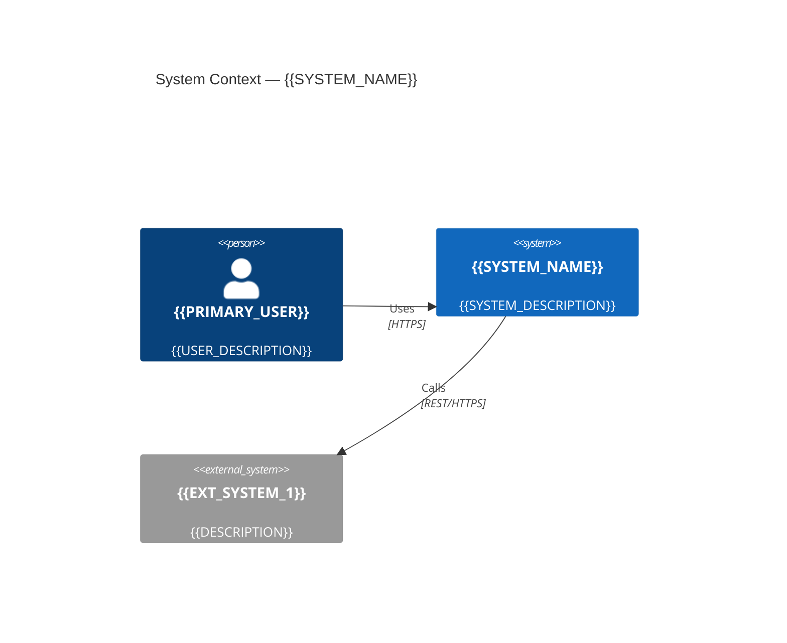
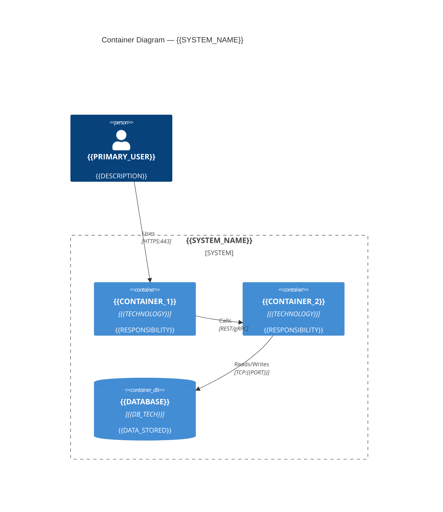

# Design Brief Template

<!-- Agent: Fill every section. Do not leave placeholders. -->

---

# Design Brief: {{SYSTEM_NAME}}

**Date:** {{DATE}}
**Architect:** {{AUTHOR}}
**Status:** Draft | Review | Approved
**Version:** 1.0

---

## 1. Problem Statement

{{PROBLEM_STATEMENT — 2-4 sentences: what situation requires this design, what constraints apply, what outcome is expected}}

## 2. Scope

**In scope:**
- {{ITEM_1}}
- {{ITEM_2}}

**Out of scope:**
- {{ITEM_1}}
- {{ITEM_2}}

## 3. Key Quality Attributes (NFRs)

| Attribute | Requirement | Measurable Target |
|---|---|---|
| Availability | {{e.g., High availability, no planned downtime}} | {{e.g., 99.9% monthly uptime}} |
| Performance | {{e.g., Low latency API}} | {{e.g., p95 < 200ms at 500 RPS}} |
| Security | {{e.g., OWASP ASVS L2 compliance}} | {{e.g., 0 Critical findings in quarterly scan}} |
| Scalability | {{e.g., Handle 10x traffic growth}} | {{e.g., Horizontal scale to 100 pods}} |
| Data Residency | {{e.g., EU data stays in EU}} | {{e.g., AWS eu-west-1 only}} |

## 4. C4 Architecture Diagrams

### Level 1: System Context



**Trust boundaries:** {{List where trust boundaries exist}}
**Zero Trust note:** All external actors are untrusted by default (NIST SP 800-207).

### Level 2: Container Diagram



### STRIDE Threat Annotations (Per Container)

| Container | S (Spoofing) | T (Tampering) | R (Repudiation) | I (Info Disclosure) | D (DoS) | E (EoP) |
|---|---|---|---|---|---|---|
| {{CONTAINER_1}} | {{threat + mitigation}} | {{threat + mitigation}} | {{threat + mitigation}} | {{threat + mitigation}} | {{threat + mitigation}} | {{threat + mitigation}} |
| {{CONTAINER_2}} | | | | | | |

### Level 3: Component Diagram (if required)

```mermaid
C4Component
  title Component Diagram — {{CONTAINER_NAME}}
  {{COMPONENTS}}
```

## 5. Architecture Decisions

| ADR | Decision | Rationale |
|---|---|---|
| [ADR-0001](../decisions/0001-{{title}}.md) | {{Decision}} | {{1-sentence rationale}} |
| [ADR-0002](../decisions/0002-{{title}}.md) | {{Decision}} | {{1-sentence rationale}} |

## 6. DDD Bounded Contexts (if applicable)

```mermaid
graph TD
  {{BOUNDED_CONTEXT_MAP}}
```

**Ubiquitous language:** see `docs/architecture/ubiquitous-language/{{CONTEXT_NAME}}.md`

## 7. Security Design

### 7.1 Authentication and Authorization
- **Authentication:** {{e.g., OAuth2 + OIDC via Auth0; JWT bearer tokens, 15-min expiry + refresh rotation}}
- **Authorization:** {{e.g., RBAC with roles: admin, user, viewer; enforced server-side on every endpoint}}
- **MFA:** {{e.g., Required for all users; hardware tokens for admin roles}}

### 7.2 Data Classification and Encryption
| Data Type | Classification | At Rest | In Transit | Notes |
|---|---|---|---|---|
| {{DATA_TYPE_1}} | {{Public/Internal/Confidential/Restricted}} | {{AES-256 / Not required}} | {{TLS 1.3}} | {{e.g., PII — subject to GDPR}} |
| {{DATA_TYPE_2}} | | | | |

### 7.3 Zero Trust Assumptions
- No implicit trust between services — all internal calls require authentication
- Reference: NIST SP 800-207
- Implementation: {{e.g., mTLS via service mesh (Istio/Linkerd), SPIFFE workload identity}}

### 7.4 Security Controls Applied
- [ ] OWASP ASVS Level {{1/2/3}} compliance targeted
- [ ] STRIDE threat model completed (Section 4)
- [ ] Well-Architected Security Pillar review planned
- [ ] Applicable compliance frameworks: {{ISO 27001 / SOC 2 / PCI-DSS / HIPAA / None}}

### 7.5 Security Risks (Open)
| Risk | Severity | Mitigation | Owner |
|---|---|---|---|
| {{RISK_1}} | {{Critical/High/Medium/Low}} | {{Mitigation}} | {{Owner}} |

## 8. Well-Architected Alignment

| Pillar | Status | Notes |
|---|---|---|
| Operational Excellence | {{Pass/Partial/Gap}} | {{Notes}} |
| Security | {{Pass/Partial/Gap}} | {{Notes}} |
| Reliability | {{Pass/Partial/Gap}} | {{Notes}} |
| Performance Efficiency | {{Pass/Partial/Gap}} | {{Notes}} |
| Cost Optimization | {{Pass/Partial/Gap}} | {{Notes}} |
| Sustainability | {{Pass/Partial/Gap}} | {{Notes}} |

## 9. Deployment Overview

```mermaid
C4Deployment
  title Deployment — {{SYSTEM_NAME}} Production
  {{DEPLOYMENT_NODES}}
```

**Environments:**
| Environment | Purpose | Notes |
|---|---|---|
| Development | Local dev | Docker Compose |
| Staging | Pre-prod validation | Cloud, reduced capacity |
| Production | Live traffic | {{HA, multi-AZ, auto-scaling}} |

## 10. Open Questions and Risks

| ID | Type | Description | Owner | Target |
|---|---|---|---|---|
| OQ-01 | Open Question | {{Question requiring decision}} | {{Owner}} | {{Date}} |
| R-01 | Risk | {{Risk description}} | {{Owner}} | {{Mitigation date}} |

---

*Generated by architect:design agent | Frameworks: C4, MADR, STRIDE, NIST SP 800-207*
